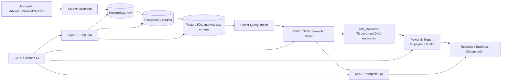
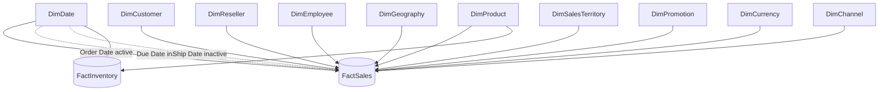

# Retail360 — Enterprise Retail Analytics Platform

[](https://github.com/rjraunak04/retail360-powerbi-analytics/actions/workflows/postgres-stage2-ci.yml)

Retail360 is an end-to-end retail analytics portfolio project built with **PostgreSQL, SQL, Power Query, Power BI, DAX, PBIP/TMDL, Docker and GitHub Actions**.

The project turns Microsoft AdventureWorksDW source data into a governed analytical platform for **sales, profitability, customers, resellers, products, promotions, geography and inventory**.

> Portfolio goal: demonstrate the complete path from raw files to a tested dimensional warehouse, semantic model, enterprise DAX layer, multi-page Power BI report, security controls and reproducible engineering QA.

## Business questions

Retail360 is designed to answer:

- How are sales, units, orders and gross profit changing over time?
- Which products and categories drive revenue and margin?
- How does Internet performance compare with Reseller performance?
- Which customers and resellers generate the most value?
- Which territories contribute the most sales?
- How much sales volume is discounted?
- What is the latest inventory position?
- Which products are below safety-stock thresholds?
- Can executives trust the KPI values shown in the report?

## Portfolio highlights

| Area | Implementation |
|---|---|
| Source | Microsoft AdventureWorksDW CSV data |
| Warehouse | PostgreSQL 16 with raw, staging, analytics and audit schemas |
| Modelling | Governed dimensional star schema |
| Sales fact | 121,253 harmonized Internet + Reseller sales lines |
| Inventory fact | 776,286 product/date snapshots |
| Semantic model | PBIP + source-controlled TMDL |
| DAX | 78 explicit governed measures |
| Report UX | 10 analytical pages + 1 hidden report-page tooltip |
| Report visuals | 62 CI-validated visual containers |
| Security | Territory-based demonstration RLS roles |
| QA | SQL, Python, DAX, PBIP/PBIR, PowerShell and GitHub Actions |
| Source control | Git feature-branch workflow with reproducible CI |

## Verified KPI baseline

These values are reconciled from PostgreSQL and the live Power BI semantic model.

| KPI | Verified value |
|---|---:|
| Total Sales | 109,809,274.2030 |
| Total Product Cost | 97,257,907.9547 |
| Gross Profit | 12,551,366.2483 |
| Units Sold | 274,776 |
| Distinct Orders | 31,455 |
| Customers | 18,484 |
| Repeat Customers | 6,865 |
| Resellers | 635 |
| Products Sold | 350 |
| Internet Sales | 29,358,677.2207 |
| Reseller Sales | 80,450,596.9823 |
| Current Inventory Value | 23,603,975.5700 |
| Current Inventory Units | 258,981 |
| Products Below Safety Stock | 543 |

## Architecture



Detailed architecture: [docs/architecture/retail360-architecture.md](docs/architecture/retail360-architecture.md)

## Semantic star schema



Detailed model: [docs/architecture/star-schema.md](docs/architecture/star-schema.md)

## Power BI report

The source-controlled PBIR report contains:

1. Executive Overview
2. Sales & Growth
3. Product & Profitability
4. Customer Analytics
5. Channel / Reseller Analytics
6. Geography & Territory
7. Promotion Analysis
8. Inventory Analytics
9. Drill-through Detail
10. Model / Data Quality
11. Product Tooltip — hidden report-page tooltip

The report follows a 1280×720 layout system, governed semantic measures, compact slicers, native visuals, drillthrough and tooltip behavior.

Report design details: [docs/powerbi/stage7-report-ux.md](docs/powerbi/stage7-report-ux.md)

Dashboard gallery: [docs/screenshots/README.md](docs/screenshots/README.md)

## DAX governance

The model contains **78 explicit measures** in the `KPI_Measures` host table.

Examples:

- Total Sales
- Units Sold
- Distinct Orders
- Average Order Value
- Gross Profit
- Gross Margin %
- Sales YTD / PY / YoY %
- Internet Sales / Reseller Sales
- Repeat Customer %
- Product Sales Share %
- Current Inventory Value
- Inventory Turnover
- Safety Stock Risk %
- Sales by Due Date
- Sales by Ship Date

Key rules:

- Gross Margin % = Gross Profit / Total Sales; row-level margin percentages are never averaged.
- Distinct Orders use Channel + Sales Order Number to avoid channel identifier collisions.
- Due Date and Ship Date measures use inactive relationships via `USERELATIONSHIP`.
- Inventory headline KPIs use the latest snapshot rather than summing all historical snapshots.
- Consolidated monetary KPIs remain currency-symbol neutral because currency-rate history is outside project scope.

Full dictionary: [docs/powerbi/kpi-dictionary.md](docs/powerbi/kpi-dictionary.md)

## Enterprise features

- territory-based static demonstration RLS roles:
  - `RLS_North_America`
  - `RLS_Europe`
  - `RLS_Pacific`
- fail-closed inventory behavior under territory roles because inventory has no territory grain
- active Order Date plus inactive Due/Ship role-playing relationships
- explicit measures only; implicit measures discouraged
- PBIP/TMDL/PBIR source control
- report structural/performance contracts
- least-privilege Power BI database access
- GitHub Actions regression testing

Stage 8 evidence: [docs/data-engineering/stage8-validation-summary.md](docs/data-engineering/stage8-validation-summary.md)

## Validation evidence

Retail360 is intentionally tested as an engineering project rather than only visually inspected.

| Validation layer | Evidence |
|---|---|
| Source files | parser, row-shape, PK/FK integrity |
| PostgreSQL raw | 14-table row-count reconciliation |
| Staging | typed transformation and business-rule QA |
| Analytics | fact grain, FKs and metric preservation |
| Semantic model | tables, relationships, role dates, parameters |
| Stage 6 SQL | KPI benchmark reconciliation |
| Stage 6 Power BI | 34/34 exact KPI runtime checks |
| DAX | 78/78 governed-measure smoke checks |
| Report | page/visual/binding/drillthrough/tooltip validation |
| Enterprise QA | RLS, edge cases, optimization and deployment contracts |

Canonical Stage 6 runtime evidence:

- [Exact KPI runtime proof](docs/data-engineering/stage6-powerbi-runtime-proof.csv)
- [78-measure smoke proof](docs/data-engineering/stage6-measure-smoke-proof.csv)
- [Stage 6 validation summary](docs/data-engineering/stage6-validation-summary.md)

## Data-quality decisions

Retail360 keeps source behavior visible instead of silently rewriting it.

Examples:

- unknown/not-applicable surrogate members are controlled in analytical dimensions
- blank Date surrogate member was removed because no fact row used it
- 3,319 historical inventory snapshots with negative units balance are preserved and validated rather than hidden
- channel applicability is explicitly tested
- currency totals are not falsely labeled USD without an exchange-rate fact

See [docs/recruiter/project-decisions.md](docs/recruiter/project-decisions.md).

## Quick start

Prerequisites:

- Git
- Python 3.11+
- Docker Desktop
- Power BI Desktop
- PostgreSQL client libraries via Python dependencies

Clone:

```powershell
git clone https://github.com/rjraunak04/retail360-powerbi-analytics.git
cd retail360-powerbi-analytics
python -m venv .venv
.\.venv\Scripts\Activate.ps1
pip install -r requirements.txt
```

Start PostgreSQL:

```powershell
docker compose up -d postgres
```

Open the Power BI project:

```powershell
Start-Process .\powerbi\Retail360.pbip
```

Full setup and validation sequence: [docs/recruiter/setup-guide.md](docs/recruiter/setup-guide.md)

## Repository map

```text
retail360-powerbi-analytics/
├── data/                         # source / local data workflow
├── dax/                          # DAX QA copies
├── docs/
│   ├── architecture/             # architecture + star schema
│   ├── business/                 # project charter
│   ├── data-engineering/         # validation evidence
│   ├── data-model/               # semantic model documentation
│   ├── deployment/               # refresh/deployment guidance
│   ├── powerbi/                  # KPI/report documentation
│   ├── qa/                       # enterprise QA
│   ├── recruiter/                # CV/interview/profile material
│   ├── screenshots/              # report gallery
│   └── sql/                      # recruiter-friendly SQL examples
├── power-query/                  # source-controlled M queries
├── powerbi/                      # PBIP / PBIR / TMDL project
├── scripts/                      # build + validation automation
├── sql/                          # warehouse/staging/analytics SQL
├── compose.yml                   # local PostgreSQL
└── .github/workflows/            # CI pipeline
```

## Recruiter package

- [Project decisions & trade-offs](docs/recruiter/project-decisions.md)
- [Setup guide](docs/recruiter/setup-guide.md)
- [Interview talking points](docs/recruiter/interview-talking-points.md)
- [CV / resume bullets](docs/recruiter/cv-bullets.md)
- [LinkedIn + GitHub descriptions](docs/recruiter/linkedin-github-description.md)
- [SQL examples](docs/sql/recruiter-sql-examples.md)

## Stage 10 deployment

Retail360's **portfolio/fallback deployment is complete**. The canonical deployable artifact remains the source-controlled `powerbi/Retail360.pbip` project.

Create the versioned recruiter/demo release package on Windows with:

```powershell
powershell -ExecutionPolicy Bypass -File .\scripts\package_stage10_release.ps1
```

This generates an ignored `dist/` folder containing a portable source package, ZIP archive, release metadata and SHA-256 checksums.

The project is **Power BI Service ready**, but this repository does not falsely claim tenant publication. Service publication, gateway/connection credentials, refresh scheduling and RLS membership are environment-specific steps documented in [the Power BI Service checklist](docs/deployment/powerbi-service-publish-checklist.md).

Stage 10 evidence: [deployment summary](docs/deployment/stage10-deployment-summary.md).

## Skills demonstrated

**Data Engineering:** PostgreSQL, SQL, dimensional modelling, staging layers, data-quality checks, reproducible loading.

**BI / Analytics Engineering:** Power Query, star schema, Power BI semantic modelling, DAX, role-playing dates, inventory snapshots, RLS, PBIP/TMDL/PBIR.

**Software Engineering:** Python automation, Docker, Git, GitHub Actions, regression tests, documentation, source-controlled metadata.

## Scope boundaries

Retail360 deliberately does **not** claim:

- causal promotion lift
- historical currency conversion without currency-rate history
- production Fabric/ADF/Synapse implementation
- identity membership deployment for RLS in a real tenant

Those are documented extensions rather than fabricated implementation claims.

## Project status

Stages 0–10 are complete for the portfolio/fallback deployment path. Power BI Service publication remains an optional tenant-specific deployment step and is not claimed without environment evidence.

See the full [project roadmap](docs/roadmap/end-to-end-build-plan.md).

## License / data

The project uses Microsoft AdventureWorks sample data for portfolio and educational purposes. Repository code, modelling decisions and analytics implementation are authored for this project.
