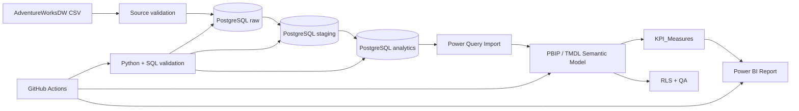

<div align="center">

# 🛒 Retail360 — Agentic Retail Analytics Platform

**End-to-end retail analytics with PostgreSQL, Power BI, governed DAX, automated QA and an evidence-grounded analytics agent.**

[](powerbi/)
[](sql/)
[](docs/powerbi/kpi-dictionary.md)
[](power-query/)
[](scripts/)
[](compose.yml)
[](https://github.com/rjraunak04/retail360-powerbi-analytics/actions/workflows/postgres-stage2-ci.yml)
[](https://github.com/rjraunak04/retail360-powerbi-analytics/actions/workflows/agent-quality-ci.yml)

**Sales • Profitability • Customers • Products • Resellers • Promotions • Territory • Inventory**

[Architecture](docs/architecture/retail360-architecture.md) •
[Star Schema](docs/architecture/star-schema.md) •
[KPI Dictionary](docs/powerbi/kpi-dictionary.md) •
[Dashboard Gallery](docs/screenshots/README.md) •
[Portfolio Summary](docs/project/portfolio-summary.md) •
[Agent Guide](docs/agent/recruiter-guide.md) •
[Setup](docs/project/setup.md)

</div>

---

Retail360 is a source-controlled analytics platform built on **Microsoft AdventureWorksDW**. It takes raw CSV extracts through a reproducible **PostgreSQL warehouse → staging layer → analytics star schema → Power BI semantic model → governed DAX layer → report**, with automated validation at each stage.

## Why this project matters

This repository is designed to show the full analytics engineering path rather than only a finished dashboard:

- **121,253** harmonized sales lines and **776,286** inventory snapshots
- **78** governed DAX measures with **34/34** exact KPI runtime checks and **78/78** measure smoke checks
- **10** analytical report pages plus drill-through, tooltip and demonstration RLS
- source-controlled **PBIP / TMDL / PBIR** model and report assets
- reproducible PostgreSQL warehouse, Docker setup and automated QA
- governed analytics agent with semantic grounding, guarded read-only SQL and deterministic insights
- **20-question** agent benchmark enforced through GitHub Actions quality gates

**Reviewer shortcut:** [Dashboard Gallery](docs/screenshots/README.md) → [Architecture](docs/architecture/retail360-architecture.md) → [KPI Dictionary](docs/powerbi/kpi-dictionary.md) → [Agent Recruiter Guide](docs/agent/recruiter-guide.md) → [Validation Evidence](docs/data-engineering/stage8-validation-summary.md)

## Agentic analytics layer

Retail360 also includes a provider-neutral analytics agent built on top of the governed BI stack. It is designed around **grounding and evidence**, not unrestricted chatbot-to-SQL generation.

```text
Business question
      ↓
Planner
      ↓
KPI + semantic grounding
      ↓
Governed analysis workflow
      ↓
SQL guardrails
      ↓
Read-only PostgreSQL
      ↓
Evidence rows
      ↓
Deterministic insights
      ↓
Grounded response
```

The agent currently provides:

- KPI and Power BI semantic-model grounding
- read-only PostgreSQL access with schema/table allow-lists, timeout and row bounds
- governed product-sales, channel-sales, profitability and latest-inventory workflows
- deterministic observations for leaders, concentration, negative profit and inventory attention
- a 20-question version-controlled evaluation benchmark
- CI quality gates for intent routing, tool selection, KPI grounding and answer evidence
- descriptive-only insight language; promotion analysis does not claim causal lift

Quick metadata demo:

```powershell
python scripts/demo_agent.py
```

Evaluation:

```powershell
python -m agent.evaluation.evaluate
pytest -q tests/agent
```

[Recruiter / interview guide](docs/agent/recruiter-guide.md) · [Agent architecture](docs/agent/architecture.md) · [Evaluation design](docs/agent/day6-evaluation.md)

### ⚡ At a glance

| Area | Implementation |
|---|---|
| 🗄️ Warehouse | PostgreSQL 16 with `raw`, `staging`, `analytics`, `audit` schemas |
| ⭐ Data model | Governed star schema with Sales + Inventory facts |
| 🧮 Semantic layer | PBIP / TMDL / PBIR source-controlled Power BI model |
| 📊 DAX | 78 explicit governed measures |
| ✅ QA | SQL reconciliation, semantic-model checks and runtime DAX tests |
| 🐳 Local setup | Docker-based PostgreSQL environment |
| 🤖 Agent | Governed planning, guarded SQL, business workflows and evidence-backed insights |
| 🧪 Agent evaluation | 20-question benchmark + CI quality gates |
| 🔁 CI | Warehouse + agent regression validation |


**More report evidence:** [Sales & Growth](docs/screenshots/02-sales-growth.png) · [Product & Profitability](docs/screenshots/03-product-profitability.png) · [Customer Analytics](docs/screenshots/04-customer-analytics.png) · [Inventory Analytics](docs/screenshots/08-inventory-analytics.png) · [Full 10-page gallery](docs/screenshots/README.md)

## What the project covers

The model supports analysis across sales, profitability, products, customers, resellers, promotions, territories and inventory.

Key implementation points:

- PostgreSQL 16 warehouse with `raw`, `staging`, `analytics` and `audit` schemas
- harmonized Internet + Reseller sales fact with 121,253 sales lines
- inventory snapshot fact with 776,286 product/date rows
- PBIP/TMDL/PBIR source control for the Power BI model and report
- 78 explicit governed measures in `KPI_Measures`
- 34/34 exact KPI runtime checks and 78/78 measure smoke checks
- 10 analytical pages + 1 hidden report-page tooltip
- territory-based demonstration RLS
- Docker-based local PostgreSQL and GitHub Actions regression checks

## Business questions

Retail360 is designed to answer questions such as:

- How are sales, units, orders and gross profit changing over time?
- Which products and categories contribute most to revenue and margin?
- How do Internet and Reseller channels compare?
- Which customers and resellers generate the most value?
- Which territories contribute the most sales?
- How much revenue is associated with discounts?
- What is the latest inventory position?
- Which products are below safety-stock thresholds?

## Architecture



More detail:
- [Architecture](docs/architecture/retail360-architecture.md)
- [Star schema](docs/architecture/star-schema.md)
- [Architecture decisions](docs/project/architecture-decisions.md)

## Verified KPI baseline

The following values are reconciled between the PostgreSQL analytics layer and the Power BI semantic model.

| KPI | Verified value |
|---|---:|
| Total Sales | 109,809,274.2030 |
| Total Product Cost | 97,257,907.9547 |
| Gross Profit | 12,551,366.2483 |
| Units Sold | 274,776 |
| Distinct Orders | 31,455 |
| Customers | 18,484 |
| Repeat Customers | 6,865 |
| Resellers | 635 |
| Products Sold | 350 |
| Internet Sales | 29,358,677.2207 |
| Reseller Sales | 80,450,596.9823 |
| Current Inventory Value | 23,603,975.5700 |
| Current Inventory Units | 258,981 |
| Products Below Safety Stock | 543 |

## Power BI model

The semantic model uses a governed star schema with:

- `FactSales` at sales-order-line grain
- `FactInventory` at product × date snapshot grain
- conformed Date, Product, Customer, Reseller, Employee, Geography, Sales Territory, Promotion, Currency and Channel dimensions
- active Order Date plus inactive Due Date and Ship Date relationships
- explicit measures only; implicit measures are discouraged

The DAX layer includes sales, profitability, time intelligence, role-playing dates, customer/reseller, product, channel, promotion and inventory measures.

Important modelling rules:

- Gross Margin % = Gross Profit / Total Sales
- distinct orders use Channel + Sales Order Number
- Due Date and Ship Date measures use `USERELATIONSHIP`
- headline inventory KPIs use the latest snapshot rather than summing historical snapshots
- consolidated monetary values remain currency-symbol neutral because exchange-rate history is outside the project scope

[KPI dictionary](docs/powerbi/kpi-dictionary.md)

## Report

The source-controlled report contains:

1. Executive Overview
2. Sales & Growth
3. Product & Profitability
4. Customer Analytics
5. Channel / Reseller Analytics
6. Geography & Territory
7. Promotion Analysis
8. Inventory Analytics
9. Drill-through Detail
10. Model / Data Quality
11. Product Tooltip — hidden report-page tooltip

The report uses a consistent 1280×720 layout, governed measures, native visuals, drillthrough and report-page tooltips.

[Dashboard gallery](docs/screenshots/README.md)

## Validation

This repository treats validation as part of the implementation rather than as a separate manual step.

| Layer | Validation |
|---|---|
| Source | row shape, parser checks, PK/FK integrity |
| PostgreSQL raw | 14-table reconciliation |
| Staging | type and business-rule checks |
| Analytics | fact grain, FKs and metric preservation |
| Semantic model | tables, relationships, parameters and role dates |
| DAX | SQL benchmark reconciliation + runtime checks |
| Report | page, visual, binding, drillthrough and tooltip contracts |
| Security | RLS definitions and regional runtime baselines |
| Deployment | packaging, manifest and integrity checks |

Canonical Power BI runtime evidence:
- [Stage 6 exact KPI proof](docs/data-engineering/stage6-powerbi-runtime-proof.csv)
- [Stage 6 measure smoke proof](docs/data-engineering/stage6-measure-smoke-proof.csv)
- [Stage 8 enterprise QA](docs/data-engineering/stage8-validation-summary.md)

## Repository structure

```text
retail360-powerbi-analytics/
├── agent/                   # governed analytics agent, workflows and evaluation
├── data/                    # local source-data workflow
├── dax/                     # DAX QA queries
├── docs/
│   ├── agent/               # agent architecture, evaluation and recruiter guide
│   ├── architecture/        # architecture and star schema
│   ├── business/            # business context
│   ├── data-engineering/    # validation evidence
│   ├── data-model/          # semantic-model documentation
│   ├── deployment/          # deployment and refresh notes
│   ├── powerbi/             # KPI and report documentation
│   ├── project/             # setup and design decisions
│   ├── qa/                  # QA notes and packaging checks
│   ├── screenshots/         # rendered report gallery
│   └── sql/                 # concise analysis examples
├── power-query/             # M queries
├── powerbi/                 # PBIP / PBIR / TMDL source
├── scripts/                 # build and validation automation
├── sql/                     # warehouse, staging and analytics SQL
├── compose.yml              # local PostgreSQL
└── .github/workflows/       # CI
```

## Quick start

Prerequisites: Git, Python 3.11+, Docker Desktop and Power BI Desktop.

```powershell
git clone https://github.com/rjraunak04/retail360-powerbi-analytics.git
cd retail360-powerbi-analytics
python -m venv .venv
.\.venv\Scripts\Activate.ps1
pip install -r requirements.txt
docker compose up -d postgres
Start-Process .\powerbi\Retail360.pbip
```

For the full local rebuild and validation sequence, see [Setup](docs/project/setup.md).

## Selected design decisions

A few choices are deliberate and documented:

- Internet and Reseller transactions share one harmonized sales fact.
- Inventory stays a separate snapshot fact because its grain differs from sales.
- key-0 unknown members are used only where they are meaningful.
- negative historical inventory rows are preserved and validated rather than silently rewritten.
- promotion analysis is descriptive; the project does not claim causal lift.
- currency totals are not labeled as USD without an exchange-rate fact.
- PBIP/TMDL/PBIR is the canonical source-controlled format.

[Design decisions and trade-offs](docs/project/architecture-decisions.md)

## SQL examples

A short set of queries showing the core business logic is available in [Business analysis SQL examples](docs/sql/business-analysis-examples.md).

## Deployment

The canonical distributable artifact is the source-controlled `powerbi/Retail360.pbip` project. A versioned local release package can be generated with:

```powershell
powershell -ExecutionPolicy Bypass -File .\scripts\package_stage10_release.ps1
```

Power BI Service publication is intentionally documented as environment-specific rather than claimed without tenant evidence.

[Deployment notes](docs/deployment/stage10-deployment-summary.md)

## Scope

Implemented:
- PostgreSQL warehouse and dimensional model
- Power BI semantic model and report
- governed DAX KPI layer
- RLS demonstration roles
- automated validation
- reproducible local packaging
- governed analytics agent with guarded read-only database access
- deterministic business-analysis workflows and insights
- benchmark-driven agent evaluation and CI quality gates

Not claimed:
- causal promotion lift
- historical FX conversion without rate history
- production Fabric / ADF / Synapse implementation
- tenant-level Power BI Service deployment without environment evidence

## Status

The BI platform and agentic analytics layers are implemented with automated validation. Power BI Service publication remains an optional environment-specific deployment step.

[Project roadmap](docs/roadmap/end-to-end-build-plan.md)
