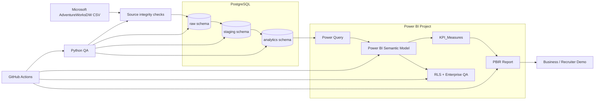

# Retail360 — End-to-End Architecture

## System overview

## Data flow

1. **Source acquisition** — official Microsoft AdventureWorksDW CSV files.
2. **Source validation** — parser, row shape, primary-key, foreign-key and source-grain checks.
3. **Raw warehouse** — 14 typed PostgreSQL landing tables.
4. **Staging** — cleaned business-friendly transformations and harmonized sales logic.
5. **Analytics** — dimensional star schema with unified sales and inventory snapshot facts.
6. **Power Query** — parameterized Import-mode access to the analytics schema.
7. **Semantic model** — conformed dimensions, role-playing dates and governed explicit measures.
8. **Report** — 10 analytical pages + hidden tooltip page.
9. **Enterprise controls** — static RLS demonstration roles, edge-case QA, performance contracts and deployment guidance.
10. **CI** — rebuilds and validates the project from source through semantic/report contracts.

## Layer responsibilities

| Layer | Responsibility |
|---|---|
| Raw | faithful typed landing |
| Staging | cleanup, harmonization, derived business fields |
| Analytics | star-schema entities and stable reporting grain |
| Semantic model | relationships, metadata, measures, business logic |
| Report | user experience and analytical storytelling |
| QA | reconciliation, security, edge cases and regressions |

## Engineering boundary

The project intentionally separates data engineering from semantic calculation logic. PostgreSQL owns stable row-level transformations; DAX owns reusable filter-context calculations. Report visuals consume governed semantic measures instead of reimplementing formulas.
