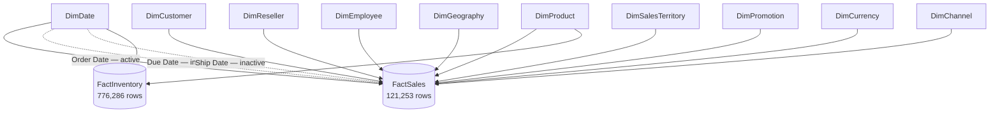

# Retail360 — Semantic Star Schema

## Relationship map

## Fact grains

### FactSales

**Grain:** one harmonized sales order line.

Combines Internet and Reseller sales through a conformed channel dimension.

Important fields include product, order/due/ship date keys, customer/reseller/employee applicability, promotion, currency, sales territory, geography, quantity, sales amount, product cost and gross profit.

### FactInventory

**Grain:** Product × Date inventory snapshot.

Headline inventory measures use the latest available snapshot. Historical inventory values are not summed to represent current stock.

## Relationship policy

- dimensions filter facts in a single direction
- no accidental many-to-many relationships
- Order Date is the active FactSales date relationship
- Due Date and Ship Date are inactive role-playing relationships
- Due/Ship measures explicitly activate their relationship with `USERELATIONSHIP`
- FactInventory joins only to Product and Date
- `KPI_Measures` is disconnected and exists only as a governed measure host

## Unknown-member policy

Key-0 members are used where Not Applicable / Unknown is analytically meaningful for dimensions such as customer, reseller, employee and geography.

The synthetic Date key 0 member was removed because no fact row used it and a blank Date value is invalid for a marked date table.
