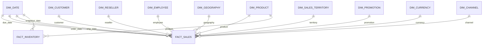

# Retail360 — Analytics Star Schema

## Purpose

The `analytics` schema is the governed Power BI-facing layer. It contains physical, constrained dimensional tables rather than exposing raw source tables or transformation views directly to report authors.

## Fact tables

### analytics.fact_sales

**Grain:** one sales order line across the unified Internet + Reseller channels.

Business identifier:

`sales_line_id = channel + sales_order_number + sales_order_line_number`

Primary analytical measures:

- order_quantity
- unit_price
- discount_amount
- total_product_cost
- sales_amount
- tax_amount
- freight
- gross_profit
- gross_margin_pct

### analytics.fact_inventory

**Grain:** one Product × Date inventory snapshot.

Primary analytical measures:

- unit_cost
- units_in
- units_out
- units_balance
- net_units_movement
- inventory_value

## Conformed dimensions

- dim_date
- dim_product
- dim_customer
- dim_reseller
- dim_employee
- dim_geography
- dim_sales_territory
- dim_promotion
- dim_currency
- dim_channel

Product category and subcategory are flattened into `dim_product` so Power BI does not require a snowflake for the principal product hierarchy.

Geography is resolved onto `fact_sales.geography_key` from the customer or reseller path, creating a direct one-to-many Geography → Sales relationship.

## Unknown / not-applicable member policy

Key `0` is reserved for Unknown / Not Applicable dimension members where required.

This is important for the unified sales fact:

- Internet sales use a real customer and `reseller_key = 0`, `employee_key = 0`.
- Reseller sales use a real reseller/employee and `customer_key = 0`.
- Missing geography can safely resolve to `geography_key = 0`.

The fact layer therefore avoids nullable dimensional foreign keys.

## Date relationships in Power BI

`order_date_key` is the primary active Date → Sales relationship.

`due_date_key` and `ship_date_key` are preserved as role-playing date keys. In Power BI they should normally be inactive relationships activated in measures with `USERELATIONSHIP` when due-date or ship-date analysis is required.

## Relationship diagram

## Performance design

The analytics layer uses:

- physical dimension/fact tables
- primary keys on every dimension
- foreign keys from facts to dimensions
- a composite primary key on FactInventory
- indexes on common FactSales filter/join keys
- an index on FactInventory date
- PostgreSQL statistics refreshed with `ANALYZE`

This layer is intentionally narrow and report-oriented compared with the source and staging layers.
