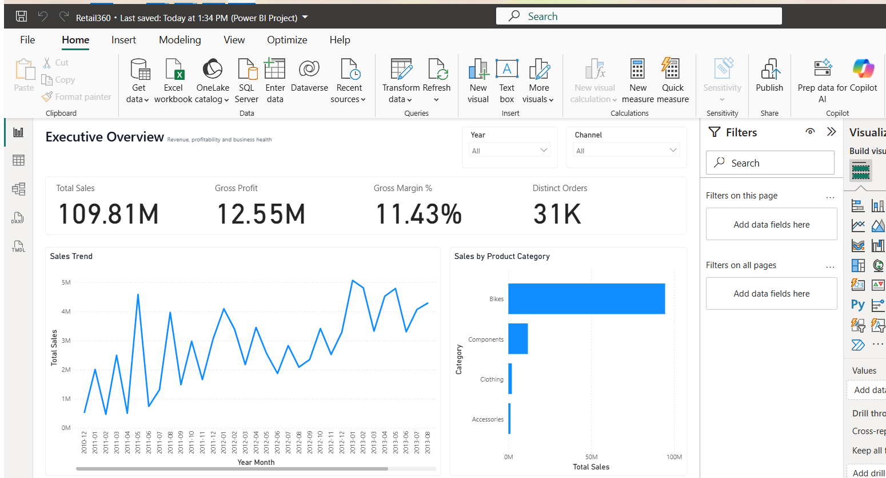
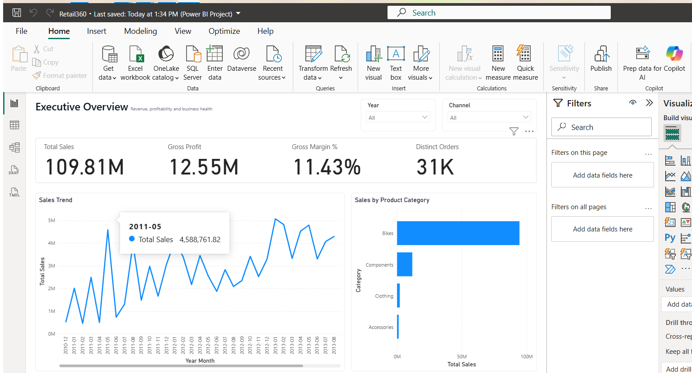
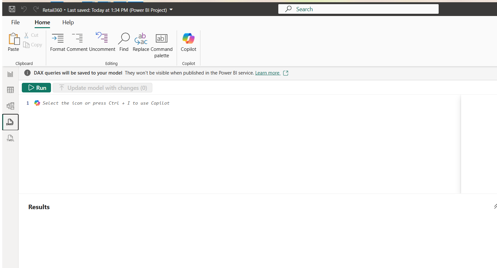

# Retail360 — Dashboard Gallery

These are **real Power BI Desktop screenshots** from the source-controlled Retail360 report. They are kept in the repository so a reviewer can inspect the finished BI output without rebuilding the project first.

## Quick preview

| Executive Overview | Product & Profitability |
|---|---|
|  |  |

| Customer Analytics | Inventory Analytics |
|---|---|
|  |  |

## Full report gallery

The report contains ten visible analytical pages:

| # | Report page | File |
|---:|---|---|
| 1 | Executive Overview | `01-executive-overview.png` |
| 2 | Sales & Growth | `02-sales-growth.png` |
| 3 | Product & Profitability | `03-product-profitability.png` |
| 4 | Customer Analytics | `04-customer-analytics.png` |
| 5 | Channel / Reseller Analytics | `05-channel-reseller.png` |
| 6 | Geography & Territory | `06-geography-territory.png` |
| 7 | Promotion Analysis | `07-promotion-analysis.png` |
| 8 | Inventory Analytics | `08-inventory-analytics.png` |
| 9 | Drill-through Detail | `09-drillthrough-detail.png` |
| 10 | Model / Data Quality | `10-model-data-quality.png` |

## Automated capture

With Retail360 fully loaded in Power BI Desktop:

```powershell
powershell -ExecutionPolicy Bypass -File .\scripts\capture_stage9_screenshots.ps1
```

To also commit and push the screenshots from the current branch:

```powershell
powershell -ExecutionPolicy Bypass -File .\scripts\capture_stage9_screenshots.ps1 -CommitAndPush
```

The capture script:

- requires exactly one Power BI Desktop window
- maximizes it
- navigates to the first visible report page
- captures the ten visible pages in order
- validates that every PNG is non-empty
- leaves the hidden Product Tooltip page out of the recruiter gallery

## Final gallery validation

```powershell
python scripts/validate_stage9_packaging.py --require-screenshots
```

Only real rendered screenshots count toward the Stage 9 image evidence gate.
